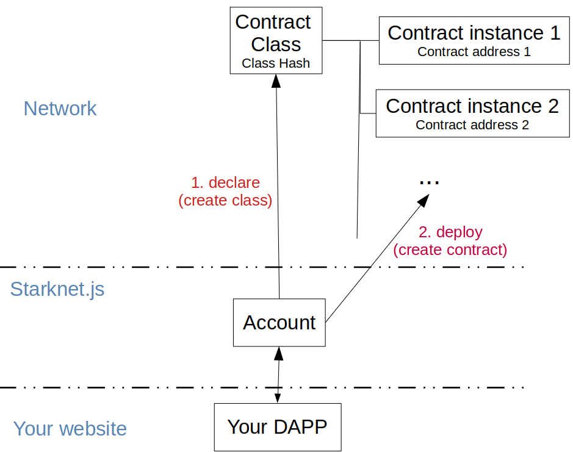

# Create new contract

When you have compiled your new Cairo contract, you can deploy it in the network.

In StarkNet, a new contract has to be added in two phases :

1. Create the contract class.
2. Deploy an instance of the contract.

> You must first declare your contract class and only then deploy a new instance of it!



> Both declaration and deployment will cost fees. That's why these functions are methods of the `Account` object. The account should be funded enough to be able to process everything.

- The contract class contains the logic of the contract. A contract class is identified by its Class Hash.
- The contract instance contains the memory storage of this instance. A contract instance is identified by its contract address. You will interact with the contract instance by using this address.

You will have only one Class Hash for the contract code, but you can have as many contract instances as you need.

Other users of the network can use your declared contract. It means that if somebody has already declared a contract class (and paid this declaration), and if you would like to have your own instance of this contract, you have only to deploy (and pay) a new instance.

Example : if you want an ERC20 contract, and somebody has already declared an ERC20 contract that conforms to your needs, you have just to deploy a new instance of this contract class.

```typescript
import { Provider, Account, Contract, ec, json, stark, uint256, shortString } from "starknet";
```

## Class Hash 😕

TLDR : Starknet.js is not (yet) able to calculate a Class Hash 😮.

The Class Hash should be a result of the compilation, but today, it's not recorded in the compiled file. It could be calculated during the declaration activity, but it's actually too long to process.

So you need to calculate yourself the Class hash, and add it as constant in your code.

> You can calculate it with some other tool, for example: [Starkli](https://github.com/xJonathanLEI/starkli)

## `declareDeploy()` your new contract

Starknet.js proposes a function to perform both operations in one step : `declareDeploy()`.

Here, to declare & deploy a `Test.cairo` smartcontract, in Testnet 1 :

```typescript
// connect provider
const provider = new Provider({ sequencer: { network: NetworkName.SN_GOERLI } });
// connect your account. To adapt to your own account :
const privateKey0 = process.env.OZ_ACCOUNT_PRIVATE_KEY;
const account0Address: string = "0x123....789";

const starkKeyPair0 = ec.getKeyPair(privateKey0);
const account0 = new Account(provider, account0Address, starkKeyPair0);

// Declare & deploy Test contract in devnet
// ClassHash has been calculated previously with specific tool
const testClassHash = "0xff0378becffa6ad51c67ac968948dbbd110b8a8550397cf17866afebc6c17d";
const compiledTest = json.parse(fs.readFileSync("./compiled_contracts/test.json").toString("ascii"));
const deployResponse = await account0.declareDeploy({ contract: compiledTest, classHash: testClassHash });

// Connect the new contract instance :
const myTestContract = new Contract(compiledTest.abi, deployResponse.deploy.contract_address, provider);
console.log('✅ Test Contract connected at =', myTestContract.address);
```

## `deployContract()` for a new instance

If the contract class is already deployed, it's faster and cheaper to use `deployContract()`.

```typescript
// connect provider
const provider = new Provider({ sequencer: { network: NetworkName.SN_GOERLI } });
// connect your account. To adapt to your own account :
const privateKey0 = process.env.OZ_ACCOUNT_PRIVATE_KEY;
const account0Address: string = "0x123....789";

const starkKeyPair0 = ec.getKeyPair(privateKey0);
const account0 = new Account(provider, account0Address, starkKeyPair0);

// Deploy Test contract in devnet
// ClassHash has been calculated previously with specific tool
const testClassHash = "0xff0378becffa6ad51c67ac968948dbbd110b8a8550397cf17866afebc6c17d";
const deployResponse = await account0.deployContract({ classHash: testClassHash });

// read abi of Test contract
const { abi: testAbi } = await provider.getClassAt(deployResponse.contract_address);
if (testAbi === undefined) { throw new Error("no abi.") };

// Connect the new contract instance :
const myTestContract = new Contract(testAbi, deployResponse.contract_address, provider);
console.log('✅ Test Contract connected at =', myTestContract.address);
```

## `declare()` for a new class

If you want only declare a new Contract Class, use `declare()`.

```typescript
// connect provider
const provider = new Provider({ sequencer: { network: NetworkName.SN_GOERLI } });
// connect your account. To adapt to your own account :
const privateKey0 = process.env.OZ_ACCOUNT_PRIVATE_KEY;
const account0Address: string = "0x123....789";

const starkKeyPair0 = ec.getKeyPair(privateKey0);
const account0 = new Account(provider, account0Address, starkKeyPair0);

// Declare Test contract in devnet
// ClassHash has been calculated previously with specific tool
const testClassHash = "0xff0378becffa6ad51c67ac968948dbbd110b8a8550397cf17866afebc6c17d";
const compiledTest = json.parse(fs.readFileSync("./compiled_contracts/test.json").toString("ascii"));
const declareResponse = await account0.declare({ contract: compiledTest, classHash: testClassHash });

await provider.waitForTransaction(declareResponse.transaction_hash);
console.log('✅ Test Contract Class Hash =', declareResponse.class_hash);
```

You can use the `declare()` function for an already declared contract - it will not generate any error.
